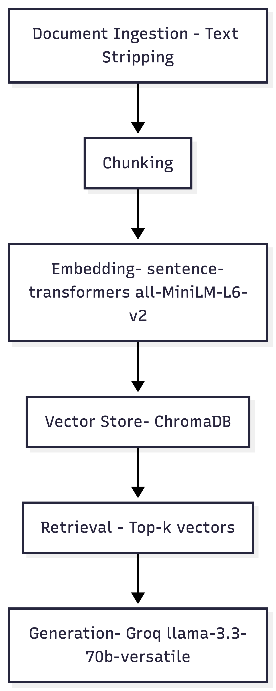

# Project 1 Planning: The Unofficial Guide

> Write this document before you write any pipeline code.
> Your spec and architecture diagram are what you'll use to direct AI tools (Claude, Copilot, etc.) to generate your implementation — the more specific they are, the more useful the generated code will be.
> Update the Retrieval Approach and Chunking Strategy sections if you change your approach during implementation.
> Update this file before starting any stretch features.

---

## Domain

<!-- What domain did you choose? Why is this knowledge valuable and hard to find through official channels? -->

My domain is parking at Queens College, CUNY. Queens, NY is a very busy city, which makes finding parking difficult, leading to students being late to classes and experiencing more stress.
There are parking garages, campus parking through a lottery, and street metered parking. Even with these many choices, parking is full most of the time.

---

## Documents

<!-- List your specific sources: URLs, subreddit names, forum threads, or file descriptions.
     Aim for at least 10 sources that together cover different subtopics or perspectives within your domain. -->

| # | Source | Type | URL or file path |
|---|--------|------|-----------------|
| 1 | Reddit | thread | https://www.reddit.com/r/QueensCollege/comments/1g45ejk/parking/ |
| 2 | Reddit | Thread | https://www.reddit.com/r/QueensCollege/comments/yptzg/where_to_park_at_queens_college/ |
| 3 | Queens College | Website | https://www.qc.cuny.edu/ps/parking-traffic-regulations/ |
| 4 | Queens College | Website | https://www.qc.cuny.edu/ps/parking/ |
| 5 | Reddit | Thread | https://www.reddit.com/r/nycrail/comments/1mf0m7n/driving_to_nyc_from_fl_staying_in_queens_for_7/ |
| 6 | Queens College | PDF | https://www.qc.cuny.edu/ps/wp-content/uploads/sites/56/2025/06/Parking-Instructions-2025-2026.pdf |
| 7 | Queens College | Website | https://www.qc.cuny.edu/a/campus-access/ |
| 8 | Reddit | Thread | https://www.reddit.com/r/AskNYC/comments/wl183a/do_we_trust_spothero/ |
| 9 | SpotAngel | Website | https://www.spotangels.com/blog/nyc-parking-tickets-where-youre-likely-to-get-one-and-how-spotangels-can-pay-for-it/ |
| 10 | Reddit | Thread| https://www.reddit.com/r/QueensCollege/comments/12toied/anyone_have_some_parking_tips/ |

---

## Chunking Strategy

<!-- How will you split documents into chunks?
     State your chunk size (in tokens or characters), overlap size, and explain why those
     numbers fit the structure of your documents.
     A review-heavy corpus warrants different chunking than a long FAQ. -->

**Chunk size:**
200 tokens

**Overlap:**
50 tokens

**Reasoning:**
Most of my sources are Reddit threads with different lengths for the questions and responses. The chunk size will account for this by taking in more characters for larger pieces of text.

---

## Retrieval Approach

<!-- Which embedding model are you using (e.g., all-MiniLM-L6-v2 via sentence-transformers)?
     How many chunks will you retrieve per query (top-k)?
     If you were deploying this for real users and cost wasn't a constraint, what tradeoffs
     would you weigh in choosing a different embedding model — context length, multilingual
     support, accuracy on domain-specific text, latency? -->

**Embedding model:**

I will be using all-MiniLM-L6-v2 via sentence-transformers for the embedding.

**Top-k:**

Using top-5 chunks

**Production tradeoff reflection:**

If cost wasn't an issue, I would make the chunks larger to give more context to the LLM.

---

## Evaluation Plan

<!-- List your 5 test questions with their expected correct answers.
     Questions should be specific enough that you can judge whether the system's response
     is right or wrong. "What are good dining halls?" is too vague.
     "What do students say about wait times at [dining hall name] during lunch?" is testable. -->

| # | Question | Expected answer |
|---|----------|-----------------|
| 1 | How much does it cost to park on campus at Queens College? | $295 per semester |
| 2 | Is there metered parking around the school? | Yes, there is |
| 3 | How can I park on campus at QC? | Purchase a decal, by first winning the parking lottery for QC |
| 4 | How much is a parking ticket in Queens | $35 - $65 |
| 5 | Is there any free parking? | Yes, free street parking around certain times |

---

## Anticipated Challenges

<!-- What could go wrong? Name at least two specific risks with reasoning.
     Consider: noisy or inconsistent documents, missing source attribution, off-topic
     retrieval, chunks that split key information across boundaries. -->

1. I think that the LLM could give the wrong answer because most of the answers given in the Reddit threads are very different and inconsistent.

2. There might not be enough information for the LLM to give a correct answer.

---

## Architecture

<!-- Draw a diagram of your pipeline showing the five stages:
     Document Ingestion → Chunking → Embedding + Vector Store → Retrieval → Generation
     Label each stage with the tool or library you're using.
     You can use ASCII art, a Mermaid diagram, or embed a sketch as an image.
     You'll use this diagram as context when prompting AI tools to implement each stage. -->

---

## AI Tool Plan

<!-- For each part of the pipeline below, describe:
     - Which AI tool you plan to use (Claude, Copilot, ChatGPT, etc.)
     - What you'll give it as input (which sections of this planning.md, which requirements)
     - What you expect it to produce
     - How you'll verify the output matches your spec

     "I'll use AI to help me code" is not a plan.
     "I'll give Claude my Chunking Strategy section and ask it to implement chunk_text()
     with my specified chunk size and overlap" is a plan. -->

**Milestone 3 — Ingestion and chunking:**

I will use Claude to help me with the chunking by preparing the text before it gets embedded.

**Milestone 4 — Embedding and retrieval:**

I will use all-MiniLM-L6-v2 via sentence-transformers to give the chunks a semantic score and retrieve the top-5 chunks.

**Milestone 5 — Generation and interface:**

Groq LLM will be used for the user inquiries and generation. I will use Streamlit for a basic interface.